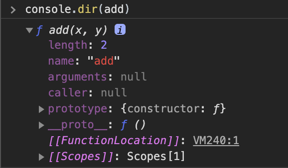
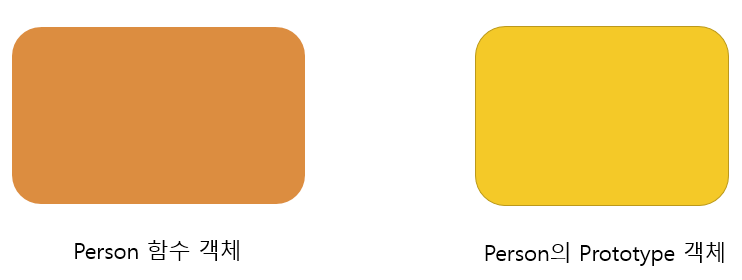
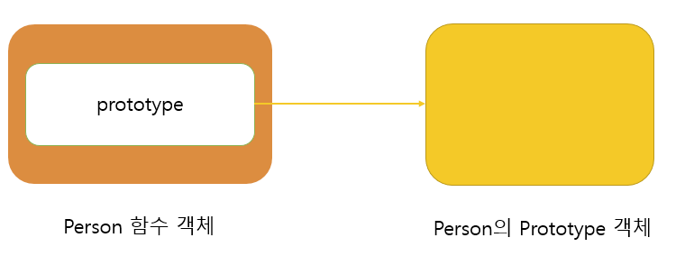
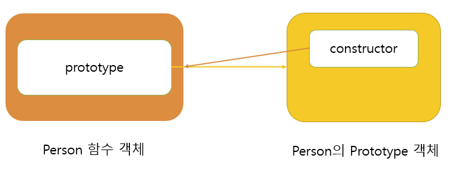
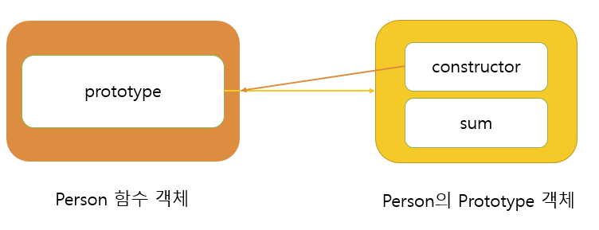
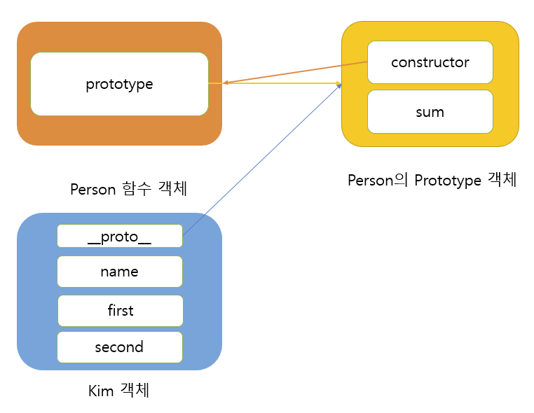

# 개요
inside javascript 중 함수에 대한 내용을 읽다가 잘 이해가 되지 않는 부분이 있었다.    
바로, 함수 안의 프로퍼티중, **prototype과 \_\_proto\_\_**의 차이..    
책 안에서는 이렇게 설명하고 있다.    
> 모든 객체에 있는 내부 프로퍼티인 \_\_proto\_\_는 객체 입장에서 자신의 부모 역할을 하는 프로토타입 객체를 가리키는 반면에, 함수 객체가 가지는 prototype 프로퍼티는 이 함수가 생성자로 사용될 때 이 함수를 통해 생성된 객체의 부모 역할을 하는 프로토타입 객체를 가리킨다.    
    
이 문장을 처음 봤을때는 .. 반복해서 읽어도 이해가 되지 않았다. 😢    
    
그래서 검색을 통해 관련 글을 읽으면서 도움을 받았다. 무엇보다 이고잉님의 강의를 본 순간 바로 이해가 됐다!    

[prototype vs \_\_proto\_\_ - JavaScript 객체 지향 프로그래밍](https://opentutorials.org/module/4047/24629)    
이고잉님의 강의 영상을 글로 정리하고자 한다.    
    
# 함수 객체의 기본 프로퍼티
자바스크립트에서는 **함수도 객체**이기 때문에 프로퍼티를 가질 수 있다.    
하지만 일반 객체와는 다르게 **함수 객체만의 표준 프로퍼티**가 정의되어있다.    
내부를 살펴보기 위해 크롬 브라우저에서 `console.dir`을 찍어보았다.    


ECMA5 스크립트 명세서에는 모든 함수가 `length`와 `prototype` 프로퍼티를 가져야 한다고 적혀있다.    
이미지를 보면, 함수 객체 역시 `length`와 `prototype`프로퍼티를 가지고 있다는것을 확인할 수 있다.    
프로퍼티 하나하나 어떤 의미를 담고 있는지 살펴보자.    

- **`length` 프로퍼티** : 인자 개수
- **`name` 프로퍼티** : 함수의 이름 (익명 함수의 경우 빈 문자열)
- **`caller` 프로퍼티**  : 자신을 호출한 함수
- **`arguments` 프로퍼티**  : 함수를 호출할 때 전달된 인자값
- **`__proto__` 프로퍼티 :** [[Prototype]]이라는 내부 프로퍼티, 부모 역할을 하는 프로토타입 객체
    - 이 함수도 객체이므로 name, caller, arguments 프로퍼티를 가지고 있다.
- **`prototype` 프로퍼티** : [[Prototype]] 프로퍼티와 혼동하면 안된다.
    
그렇다면 `prototype` 프로퍼티과 `__proto__` 프로퍼티의 차이는 뭘까?

# prototype vs \_\_proto\_\_ 
우선 Person이라는 함수를 작성한다.    

```js
function Person(name, first, second) {
	this.name = name;
	this.first = first;
	this.second = second;
}
```
**Person** 함수 객체가 생성되는 동시에, **Person의 prototype**라는 객체도 함께 생성된다.       


두 개의 객체는 서로 연관되어있다.    
서로 연관되어있다는것을 알리기 위한 프로퍼티를 각각 가지고 있고 **상호 참조** 하고 있다.    
    
**Person** 함수객체 안에는 `prototype`이라는 프로퍼티가 생기고, 그 프로퍼티는 **Person의 prototype** 객체를 가리킨다.


**Person의 prototype** 객체 안에도 `constructor`라는 프로퍼티가 있고, **Person** 함수 객체를 가리키게 된다



이런 코드를 작성하면 어떤 일이 일어날까?
```js
Person.prototype.sum = function(){}
```

**Person** 객체의 `prototype` 프로퍼티와 연결된 **Person의 prototype**객체 안에 `sum`이라는 프로퍼티가 생성된다.



이번에는 **Kim**이라는 Person 객체를 생성해보자.
```js
const Kim = new Person('kim', 10, 20);
```
Person constructor에 의해 객체가 생성되면서, this로 정의된 `name`, `first`, `second` 프로퍼티들이 할당된다.

동시에 `__proto__` 프로퍼티도 함께 생성된다. 그 프로퍼티는 바로 **Kim**이라는 객체를 생성한 **Person의 prototype**을 가리키게 된다.

    
마지막으로, 두 줄의 코드로 핵심을 확인해보자.
```js
console.log(Kim.name) //'kim'
Kim.sum()
```
위의 코드는 당연히 kim이 출력된다.    
    
그런데 아래의 코드는 오류가 나지 않는다. 🤔    

**Kim**의 프로퍼티중, `sum`을 찾다가 없으면 **kim**의 `__proto__` 프로퍼티를 참조하여, 계속 찾기 때문이다.    
**Person의 prototype** 객체에는 `sum`이라는 프로퍼티가 있으므로 정상 동작 하는 것이다.