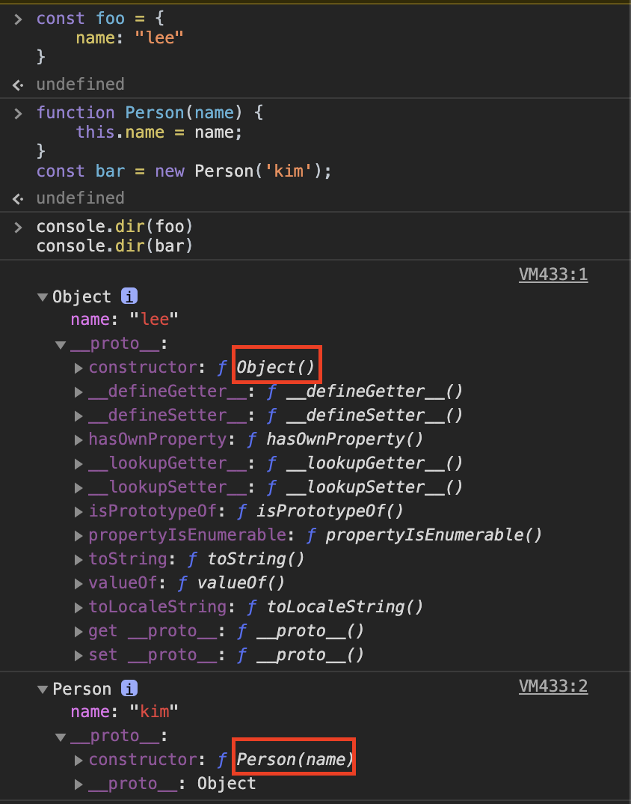
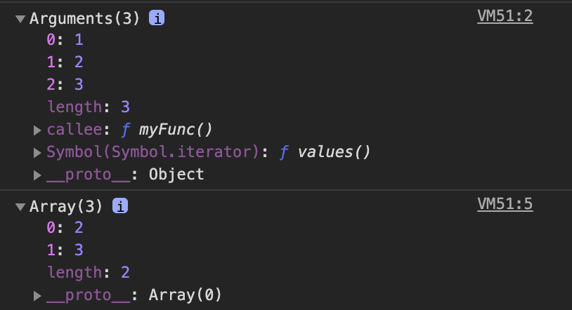

# 함수 호출과 this

## arguments 객체
---
함수 내부에는 암묵적으로 arguments 객체가 전달된다.

`length` 프로퍼티를 가진 **유사배열**객체이다. 즉, 배열 메서드를 사용할 수 없다.

(현재 실행중인 함수의 참조값을 가지고 있는 `callee` 프로퍼티도 있음)

하지만 **call과 apply 메서드를 이용한 명시적인 this 바인딩** 부분에서 배열 메서드를 사용할 수 있는 방법을 알아 볼 예정이다.

## 호출 패턴과 this 바인딩
---
함수 내부에 암묵적으로 전달되는 것에는 `arguments` 객체와 더불어 `this` 인자도 있다.

this 인자는 자바스크립트의 핵심 개념이다. this를 이해하기 어려운 이유는 자바스크립트의 여러가지 **함수가 호출되는 방식 즉, 호출 패턴**에 따라 this가 다른 **객체를 참조**하기 때문이다. **(this 바인딩)**

### 객체의 메서드 호출할 때 this 바인딩   
객체의 프로퍼티가 함수일 경우, 이 함수를 메서드라고 부든다.   
메서드에서 this는 해당 메서드를 호출한 객체로 바인딩된다.
```js
const myObject = {
    name: 'foo',
    sayName: function () {
        console.log(this.name)
    }
};

const otherObject = {
    name: 'bar'
};

otherObject.sayName = myObject.sayName;

myObject.sayName(); //foo
otherObject.sayName(); //bar
```
### 함수를 호출할 때 this 바인딩   
함수 내부에서 사용된 this는 **전역 객체**에 바인딩된다.   
- 브라우저에서 실행하는 경우에는 **window**객체
- Node.js의 경우에는 **global** 객체

주의할 점은, 메서드 내부 함수에서의 동작에서도 전역 객체에 바인딩된다는 것이다.   
```js
global.value = 100;

const myObject = {
    value: 1,
    func1: function () {
        this.value += 1;
        console.log(this.value); //2
        func2 = function () {
            this.value += 1;
            console.log(this.value); //101
            func3 = function () {
                this.value += 1;
                console.log(this.value); //102
            }
            func3()
        }
        func2()
    }
};

myObject.func1();
```
이렇게 출력되는 이유는 자바스크립트에서는 **내부 함수 호출 패턴을 정의해놓지 않기 때문**이다. 

내부 함수도 결국 함수이므로, 이를 호출할 때는 함수 호출로 취급된다.

이런 한계를 극복하려면 this를 내부함수가 접근 가능한 **다른 변수에 저장**하면 된다.
```js
global.value = 100;

const myObject = {
    value: 1,
    func1: function () {
        var that = this
        this.value += 1;
        console.log(this.value); //2
        func2 = function () {
            that.value += 1;
            console.log(that.value); //3
            func3 = function () {
                that.value += 1;
                console.log(that.value); //4
            }
            func3()
        }
        func2()
    }
};

myObject.func1();
```
혹은 화살표 함수를 사용하면 된다.
```js
global.value = 100;

const myObject = {
    value: 1,
    func1: function () {
        this.value += 1;
        console.log(this.value); //2
        func2 = () => {
            this.value += 1;
            console.log(this.value); //3
            func3 = () => {
                this.value += 1;
                console.log(this.value); //4
            }
            func3()
        }
        func2()
    }
};

myObject.func1();
```
자바스크립트에서는 이와 같은 this 바인딩의 한계를 극복하려고, this 명시적으로 샤용 할 수 있는 call과 apply 메서드를 제공한다 (뒤에서 소개예정!)

+) 엄격모드 (ECMA Script 5.1 부터)    
엄격 모드에서 함수를 실행하면, `this`가 `undefined`가 된다.
```js
function multiply(a, b) {  
    'use strict'; // 엄격 모드
    console.log(this === undefined); // => true
    return a * b;
}

multiply(2, 5); // => 10
```
### 생성자 함수를 호출할 때 this 바인딩    
자바스크립트에서는 **기존 함수에 new 연산자를 붙여서 호출하면 생성자 함수로 동작**한다.    
이는 반대로 생각하면 일반 함수에 new를 붙여도 의도하지 않게 생성자 함수로 동작할 수 있다.    
js 스타일 가이드에서는, 생성자 함수 이름의 **첫 문자를 대문자**로 쓰기를 권하고 있다.    
[생성자 함수에서의 this 동작을 알아보기 이전에, 생성자 함수가 동작하는 방식을 알아보자.]
1. 빈 객체 생성 및 this 바인딩    
    빈 객체를 생성하고, this로 바인딩 된다. 이 객체는 생성자의 prototype 객체를 자신의 프로토타입 객체로 설정한다.
2. this를 통한 프로퍼티 생성    
    함수 코드 내부에서 this를 사용해서, 빈 객체에 동적으로 프로퍼티나 메서드를 생성할 수 있다.
3. 생성된 객체 리턴    
    일반적으로는, this로 바인딩 된 새로 생성된 객체가 리턴된다.    
    하지만 this가 아닌 다른 객체를 반환하는 경우에는 생성자 함수를 호출했더라도 this가 아닌 해당 객체가 리턴된다.

[객체 리터럴 방식과 생성자 함수를 통한 생성 방식을 비교해보자]



[생성자 함수를 new를 붙이지 않고 호출할 경우]
```js
function Person(name) {
    this.name = name;
}

const park = Person('park'); //new 없이 일반함수로 호출

console.log(park) //undefind (일반함수는 특별한 리턴값이 없으면 undefined를 리턴)
console.log(global.name) //park (일반 함수의 this는 global로 바인딩되기 때문)
```
[생성자 함수를 일반함수로 호출하는 오류 피하기]

더글라스 크락포드와 같은 자바스크립트 전문가들은 객체를 생성하는 다음과 같은 별도의 패턴을 사용하기도 한다.
```js
function A(arg) {
    if (!(this instanceof A)) // 혹은 if (!(this instanceof arguments.callee))
        return new A(arg);
    this.value = arg ? arg : 0
}

const a = new A(100);
const b = A(200)

console.log(a.value) //100
console.log(b.value) //200
console.log(global.value) //undefined
```
+) class (ECMAScript 6)     
class 예약어에서 메소드를 실행하면, this가 인스턴스 자신을 가리킨다.
```js
class Person {
    constructor(name) {
        this.name = name; 
    }
    getName() {
        console.log(this === Person); //true
        return this.name;
    }
}
const me = new Person('sara');
me.getName(); //'sara' 
```
## call과 apply 메서드를 이용한 명시적인 this 바인딩
---
위에서 살펴본바와 같이 this는 **정해진 객체에 자동으로 바인딩**된다.

이런 내부적인 this 바인딩 외에도 this를 특정 객체에 **명시적으로 바인딩**시키는 방법도 존재한다.

> apply() 와 call()

이 메서드들은 **모든 함수의 부모 객체**인 `Function.prototype` 객체의 메서드이므로 모든 함수는 다음과 같은 형식으로 호출할 수 있다.
```js
Person.apply(thisArg, argArray);
```
여기서 기억해야할 것은 `apply()` 메서드를 호출하는 주체가 함수고 `apply()` 메서드가 this를 특정 개체에 바인딩 할 뿐 결국 본질적인 기능은 **함수 호출** 이라는 것이다.

`Person.apply()`를 호출한다면 기본 기능은 `Person()` 함수를 호출하는 것이다.
```js
function Person(name, age) {
    this.name = name;
    this.age = age;
}

const foo = {};

Person.apply(foo, ['sara', 26]);

console.dir(foo) //{ name: 'sara', age: 26 }
```
`Person()`을 호출하며 `foo` 객체를 `Person()` 함수의 `this`로 바인딩 시킨다.

**`apply()`와 `call()`의 차이**는 이것뿐이다.
```js
Person.apply(foo, ['sara', 26]); //인자를 배열로 전달
Person.call(foo, 'sara', 26); //인자를 하나하나 전달
```


apply()와 call()의 대표적인 사용 용도는 **유사 배열 객체에서 배열 메서드를 사용하는 경우**이다.
```js
function myFunc() {
    console.dir(arguments) //[Arguments] { '0': 1, '1': 2, '2': 3 }
    //console.log(arguments.shift()) //유사배열 객체이므로 배열 메서드를 사용할 수 없다.
    const args = Array.prototype.slice.apply(arguments)
    console.dir(args) //[ 1, 2, 3 ]
    console.log(args.shift()) //1
}

myFunc(1, 2, 3)
```
위의 `apply()` 함수는, `arguments` 객체를 인자로 하며 `Array.prototype.slice()`를 인자 없이 호출한 형태가 된다.

`slice()` 함수는 인자 없이 호출한 경우 배열을 복사하여 리턴한다.    
 즉, `this`가 `arguments`인 `Array.prototype` 복사본을 `args` 변수에 할당한다.



_ _ proto _ _ 가 Object 였다가 Array(0)로 변경된 모습

## 정리
---
1. 기본 : this는 전역 객체를 가리킨다. 
2. 메소드 : 객체에 속한 함수 즉 메서드에서는 그 메서드의 객체를 가리킨다.    
    메서드의 내부함수에서는 전역 객체를 가리킨다!
3. 생성자 함수 : 생성자로 인해 생성된 새로운 객체를 가리킨다.
4. call, aplly : 직접 실행문맥을 전한다. 즉, this를 특정 객체에 바인딩 할 수 있다.